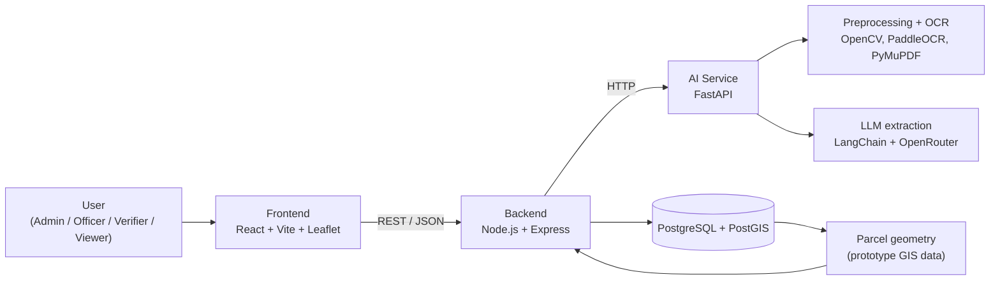
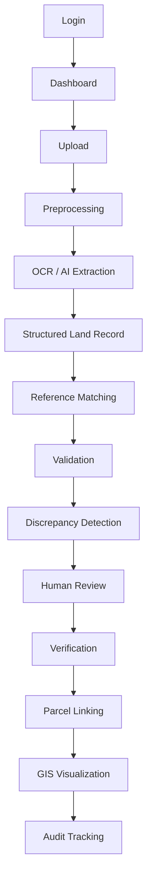
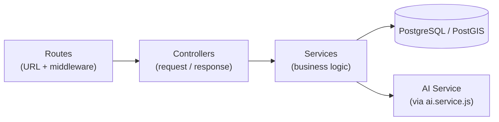
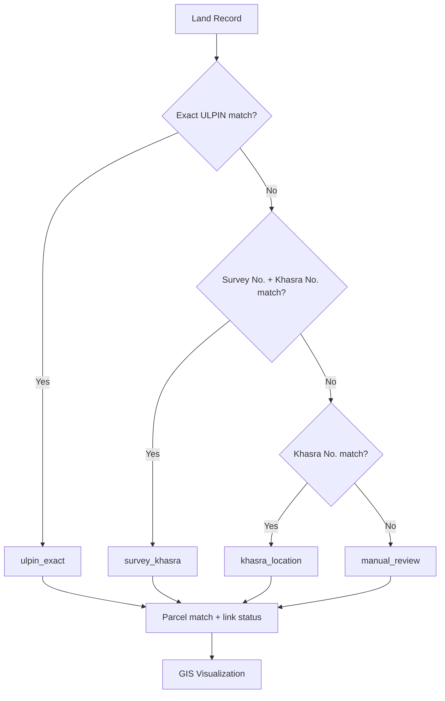
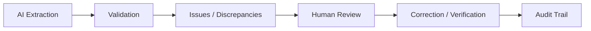
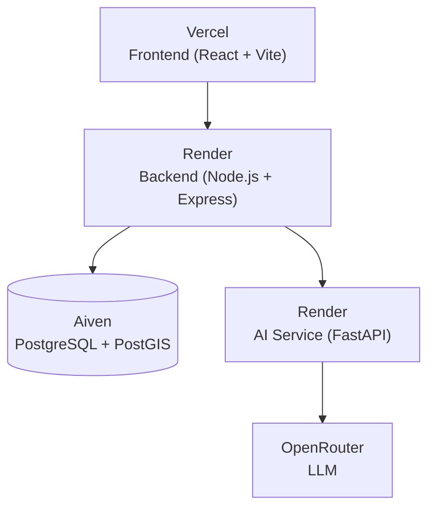

# IntelliLandAI

**AI-powered land record digitization, validation and parcel linking platform**

IntelliLandAI is a working prototype built for Smart India Hackathon 2026. It takes scanned and legacy land-record documents, extracts structured fields using OCR and an LLM, checks them against reference/demo data, sends discrepancies to a human reviewer, links each record to a GIS parcel, and shows the result on a map, with an audit trail for every important action.

> **Core concept**
>
> | | |
> |---|---|
> | **Document** | tells us **WHAT / WHICH LAND** |
> | **GIS** | tells us **WHERE** |
> | **Validation** | checks **WHETHER THE INFORMATION IS CONSISTENT** |

> ⚠️ **Prototype notice**
> IntelliLandAI is an AI-assisted decision-support prototype running entirely on **synthetic/demo data**. It is **not** connected to any government database and does **not** replace authorized government verification, legal land-record authorities, or official government systems. AI output is meant to be reviewed by a human.


---

## 🎥 Demo Video

[▶️ Watch: IntelliLandAI – AI-Powered Land Record Digitization, Validation & GIS Parcel Linking](https://youtu.be/6ntKG6ohBbA?si=KandPt-S9j1Q472e)

## 🌐 Live Demo

[🚀 Open the IntelliLandAI Live Demo](https://intelliland-auvb9qa8u-bhumatrix.vercel.app/login)

> The Backend and AI Service run on free-tier hosting, so the **first request after a period of inactivity can take a while** while the services wake up. If the first login or page load is slow, please wait a moment and retry.

## 🔐 Demo Login Credentials

| Role | Email | Password |
|---|---|---|
| Admin | `admin@intelliland.local` | `Admin@123` |

These credentials exist **only for the prototype/demo environment**. Do not reuse them in any real deployment.

---

## 🧪 Evaluator / Demo Guide

The quickest way to see the complete workflow is to use the **pre-processed sample documents**. They have already been through extraction, so you can inspect every stage without triggering new AI processing.

### Recommended evaluation path

1. Open the [Live Demo](https://intelliland-auvb9qa8u-bhumatrix.vercel.app/login).
2. Log in with the [demo credentials](#-demo-login-credentials) above.
3. Go to **Documents**.
4. Pick one of the already processed sample records (see [Recommended Sample Documents](#-recommended-sample-documents)).
5. Open the document and explore:
   - **Extracted land-record fields** (structured extraction)
   - **Validation results** and flagged discrepancies
   - **Human verification / review**
   - **Audit history**
   - **Parcel linking**
   - **GIS visualization** on the map

You do **not** need to upload and re-process documents to evaluate the project.

### About live AI processing

Live document processing through the AI Service is supported. It relies on a third-party inference provider (OpenRouter-compatible LLM), so it is subject to that provider's availability and usage limits. The pre-processed samples exist so the full end-to-end workflow can be evaluated reliably without repeated external AI requests.

If you do try live upload, please expect that it may be slow or occasionally unavailable, and that extraction quality depends on document quality, language and handwriting.

## 📄 Recommended Sample Documents

The source PDFs for the synthetic samples are in [`sample-data/documents/`](./sample-data/documents/). In the live demo, use the already processed records for these samples under **Documents**.

**Suggested starting points**, one per document type:

| Document | Type | Quality | What to explore |
|---|---|---|---|
| [ROR_001.pdf](./sample-data/documents/ror/ROR_001.pdf) | RoR / Khatauni | Clean | Extracted land record; validation is expected to match |
| [ROR_002.pdf](./sample-data/documents/ror/ROR_002.pdf) | RoR / Khatauni | Medium | Discrepancy detection; validation is expected to mismatch |
| [MUTATION_001.pdf](./sample-data/documents/mutation/MUTATION_001.pdf) | Mutation | Medium | Mutation-related validation; expected to mismatch |
| [REGISTRATION_001.pdf](./sample-data/documents/registration/REGISTRATION_001.pdf) | Registration | Clean | Registration data extraction |
| [HANDWRITTEN_001.pdf](./sample-data/documents/handwritten/HANDWRITTEN_001.pdf) | Handwritten | Medium | Handwritten / Hindi-language processing |

### All sample documents

| Document | Type | Language | Quality | Expected validation |
|---|---|---|---|---|
| [ROR_001.pdf](./sample-data/documents/ror/ROR_001.pdf) | RoR | Hindi-English | Clean | Match |
| [ROR_001_POOR_QUALITY.pdf](./sample-data/documents/ror/ROR_001_POOR_QUALITY.pdf) | RoR | Hindi-English | Poor | Match |
| [ROR_002.pdf](./sample-data/documents/ror/ROR_002.pdf) | RoR | Hindi | Medium | Mismatch |
| [MUTATION_001.pdf](./sample-data/documents/mutation/MUTATION_001.pdf) | Mutation | Hindi-English | Medium | Mismatch |
| [REGISTRATION_001.pdf](./sample-data/documents/registration/REGISTRATION_001.pdf) | Registration | English | Clean | Match |
| [REGISTRATION_001_POOR_QUALITY.pdf](./sample-data/documents/registration/REGISTRATION_001_POOR_QUALITY.pdf) | Registration | English | Poor | Match |
| [REGISTRATION_002.pdf](./sample-data/documents/registration/REGISTRATION_002.pdf) | Registration | Hindi-English | Poor | Mismatch |
| [HANDWRITTEN_001.pdf](./sample-data/documents/handwritten/HANDWRITTEN_001.pdf) | Handwritten | Hindi | Medium | Match |
| [HANDWRITTEN_001_POOR_QUALITY.pdf](./sample-data/documents/handwritten/HANDWRITTEN_001_POOR_QUALITY.pdf) | Handwritten | Hindi | Very poor | Match |
| [HANDWRITTEN_002.pdf](./sample-data/documents/handwritten/HANDWRITTEN_002.pdf) | Handwritten | Hindi | Poor | Mismatch |

"Expected validation" comes from the dataset metadata ([`dataset.json`](./sample-data/metadata/dataset.json)) and describes the outcome the sample was designed to produce. All samples are **synthetic/demo documents**, not real land records.

---

## 📑 Table of Contents

- [Problem](#-problem)
- [Solution](#-solution)
- [Key Features](#-key-features)
- [System Architecture](#-system-architecture)
- [End-to-End Workflow](#-end-to-end-workflow)
- [Technology Stack](#-technology-stack)
- [Frontend](#-frontend)
- [Backend](#-backend)
- [AI Service](#-ai-service)
- [Database](#-database)
- [GIS & Parcel Linking](#-gis--parcel-linking)
- [Validation & Human Verification](#-validation--human-verification)
- [Deployment Architecture](#-deployment-architecture)
- [Repository Structure](#-repository-structure)
- [Local Setup](#-local-setup)
- [Environment Variables](#-environment-variables)
- [Running Locally](#-running-locally)
- [API Overview](#-api-overview)
- [Sample Data](#-sample-data)
- [Security](#-security)
- [Government / Domain Context](#-government--domain-context)
- [Limitations](#-limitations)
- [Future Scope](#-future-scope)
- [Contributing](#-contributing)
- [License](#-license)
- [Acknowledgements](#-acknowledgements)

---

## 🧩 Problem

Land-record modernization runs into a few practical problems:

- Large volumes of records exist only as **scanned or legacy images and PDFs**.
- Many documents are **faded, skewed, stained or noisy**, **handwritten**, or written in **local/regional languages**.
- Key details (owner, survey/khasra numbers, area, mutation and registration references) are locked inside unstructured documents.
- Textual records are often **disconnected from geographic parcels**, so it is hard to see *where* a record actually lies.
- Inconsistencies between a record and reference data are hard to catch manually at scale.
- Digitized output needs **human accountability** and an **audit trail** before anyone can rely on it.

## 💡 Solution

IntelliLandAI is an end-to-end prototype pipeline:

1. **Digitize** uploaded land-record documents with preprocessing and OCR.
2. **Extract** land-record fields into structured JSON using an LLM-assisted parser.
3. **Validate** the extracted data against reference/demo data and flag discrepancies.
4. **Verify** through a human-in-the-loop review and correction step.
5. **Link** each land record to a GIS parcel using an identifier hierarchy.
6. **Visualize** linked parcels on an interactive map.
7. **Audit** important actions for traceability.

## ✨ Key Features

| Area | Current prototype capability |
|---|---|
| Document digitization | Upload of scanned/legacy records, with preprocessing (e.g. deskewing) and OCR |
| Document diversity | Designed for printed and handwritten records and local/regional-language documents |
| Structured extraction | AI Service returns structured JSON with land-record fields |
| Validation | Comparison of extracted data with reference/demo data and discrepancy detection |
| Human verification | Review, correction and verification before a record is treated as verified |
| Parcel linking | Identifier-hierarchy matching (ULPIN → Survey + Khasra → Khasra → manual review) |
| GIS visualization | Leaflet map of linked parcels with parcel details |
| Access control | JWT authentication with role-based authorization |
| Audit tracking | Audit logging and an audit-history view |
| Dashboard | Overview of documents and processing state |

## 🏗️ System Architecture

The application is modular: **Frontend → Backend → AI Service → Database / GIS**.



| Layer | Responsibility |
|---|---|
| **Frontend** | Login, dashboard, upload, document details, validation review, verification, GIS map, audit history |
| **Backend** | Authentication and authorization, file upload, document and land-record APIs, validation and verification workflows, parcel linking, audit logging, database access, and calls to the AI Service |
| **AI Service** | Document preprocessing, OCR/text extraction, LLM-assisted field extraction and normalization; returns structured JSON to the Backend |
| **Database / GIS** | Storage of users, documents, land records, validation/verification results, audit logs, and PostGIS parcel geometry |

Where each layer is hosted is covered in [Deployment Architecture](#-deployment-architecture).

## 🔄 End-to-End Workflow



| Step | What happens |
|---|---|
| Login | The user authenticates and receives a JWT; UI access depends on role |
| Dashboard | Overview of documents and processing status |
| Upload | A scanned/legacy land record (image or PDF) is uploaded through the Backend |
| Preprocessing | The AI Service cleans the document (e.g. deskewing) to improve readability |
| OCR / AI Extraction | OCR and LLM-assisted parsing pull out the land-record fields |
| Structured Land Record | Extracted fields are normalized into a structured record |
| Reference Matching | The record is compared with reference/demo data |
| Validation | Field-level consistency checks are run |
| Discrepancy Detection | Mismatches and issues are flagged |
| Human Review | A reviewer inspects extracted values and flagged issues |
| Verification | The reviewer corrects and/or verifies the record |
| Parcel Linking | The record is matched to a GIS parcel using the identifier hierarchy |
| GIS Visualization | The linked parcel is shown on the map |
| Audit Tracking | Actions are logged and visible in the audit history |

## 🧰 Technology Stack

| Layer | Technology | Purpose |
|---|---|---|
| Frontend | React, Vite, Tailwind CSS / CSS, Axios | Single-page application and API communication |
| Backend | Node.js, Express.js, REST APIs | Business logic, workflows, API layer |
| AI Service | Python, FastAPI, Uvicorn | Document-processing microservice |
| OCR | PaddleOCR | Text extraction from scanned documents |
| Document processing | OpenCV, scikit-image, deskew, PyMuPDF | Image preprocessing, deskewing, PDF handling |
| LLM | LangChain, LangChain OpenAI integration, OpenRouter-compatible LLM | Structured field extraction and document understanding |
| Database | PostgreSQL, pgcrypto | Relational storage of application and land-record data |
| GIS | PostGIS, Leaflet / React-Leaflet | Parcel geometry storage and map visualization |
| Authentication | JWT, role-based middleware | Authentication and authorization |
| File uploads | Multer | Multipart upload handling in the Backend |
| Hosting | Vercel (Frontend), Render (Backend, AI Service), Aiven (PostgreSQL + PostGIS) | Deployed prototype |
| Version control | Git, GitHub | Source control |

## 🖥️ Frontend

**Directory:** `Frontend/` · **Stack:** React, Vite, Leaflet / React-Leaflet, CSS / Tailwind CSS, Axios

- **`pages/`**: route-level screens (`Login`, `Dashboard`, `Documents`, `DocumentUpload`, `DocumentDetails`, `ValidationReview`, `GISMap`, `AuditHistory`).
- **`components/`**: reusable UI grouped by domain (`audit`, `common`, `dashboard`, `documents`, `gis`, `layout`, `validation`).
- **`services/`**: API modules wrapping Backend calls (`api.js` for the shared Axios setup, plus `auth`, `dashboard`, `document`, `parcel`, `validation`, `verification` and `audit`).
- **`hooks/`**: data/state hooks (`useAuth`, `useDashboard`, `useDocuments`, `useValidation`).
- **`context/`**: global state via `AuthContext` and `AppContext`.
- **`routes/`** and **`layouts/`**: routing (`AppRoutes.jsx`) and the shared page shell (`MainLayout.jsx`).

```text
Frontend/src/
├── App.jsx
├── main.jsx
├── components/    (audit, common, dashboard, documents, gis, layout, validation)
├── context/       (AppContext.jsx, AuthContext.jsx)
├── hooks/         (useAuth, useDashboard, useDocuments, useValidation)
├── layouts/       (MainLayout.jsx)
├── pages/         (AuditHistory, Dashboard, DocumentDetails, DocumentUpload,
│                   Documents, GISMap, Login, ValidationReview)
├── routes/        (AppRoutes.jsx)
├── services/      (api, audit, auth, dashboard, document, parcel,
│                   validation, verification)
└── utils/
```

Data flow in the UI: **Page → Hook → Service → Backend API**, with `AuthContext` providing the authenticated session.

## ⚙️ Backend

**Directory:** `Backend/` · **Stack:** Node.js, Express.js, REST APIs, JWT, PostgreSQL client, Multer

The Backend handles authentication, authorization, document management, file upload, land-record APIs, the validation and verification workflows, parcel linking, audit logging, database access, and communication with the AI Service.

It follows a layered **Route → Controller → Service → Database** design:



- **Routes** map endpoints to controllers and attach middleware (auth, role checks, uploads).
- **Controllers** handle HTTP input/output per domain.
- **Services** hold business logic (`processing.service.js`, `validation.service.js`, `verification.service.js`, `parcel.service.js`, `audit.service.js`, `ai.service.js`, and others).
- **Middleware** covers JWT authentication, role-based authorization, upload handling and centralized error handling.
- **Config / Utils** cover environment and database configuration, JWT helpers, response helpers and validators.

```text
Backend/src/
├── app.js
├── server.js
├── config/        (db.js, env.js)
├── controllers/   (audit, auth, dashboard, document, landRecord,
│                   parcel, validation, verification)
├── middleware/    (auth, error, role, upload)
├── routes/        (audit, auth, dashboard, document, landRecord,
│                   parcel, validation, verification)
├── services/      (ai, audit, document, parcel, processing,
│                   validation, verification)
└── utils/         (jwt.js, response.js, validators.js)
```

## 🤖 AI Service

**Directory:** `ai-service/` · **Stack:** Python, FastAPI, Uvicorn, OpenCV, PaddleOCR, PyMuPDF, scikit-image, deskew, LangChain, LangChain OpenAI integration, OpenRouter-compatible LLM

```text
ai-service/
├── api/
│   ├── __init__.py
│   └── routes/
│       ├── __init__.py
│       └── document.py
├── services/
│   ├── __init__.py
│   └── document_processor.py
├── tools/
│   ├── compare.py
│   └── parser.py
└── api_server.py
```

The FastAPI app is defined in `ai-service/api_server.py`.

| Endpoint | Method | Purpose |
|---|---|---|
| `/ai/process-document` | `POST` | Processes an uploaded land-record document and returns structured JSON |
| `/health` | `GET` | Health check |

Interactive API docs (FastAPI's built-in Swagger UI) are served at `/docs`.

### Processing pipeline

```text
Document upload
  → File validation
  → Preprocessing
  → OCR / text extraction
  → Document understanding
  → Structured field extraction
  → Normalization
  → Validation support
  → Structured JSON → Backend
```

| Stage | What it does |
|---|---|
| File validation | Checks the incoming file before processing |
| Preprocessing | Image cleanup and deskewing with OpenCV, scikit-image and deskew; PDF handling with PyMuPDF |
| OCR / text extraction | PaddleOCR extracts text from the document |
| Document understanding | LLM-assisted interpretation of the extracted text (LangChain with an OpenRouter-compatible model) |
| Structured field extraction | Land-record fields are pulled into a structured form |
| Normalization | Extracted values are normalized for downstream use |
| Validation support | Comparison utilities support checking data against reference/demo data |
| Structured JSON | The result goes back to the Backend for storage, validation and review |

> Extraction quality depends on document quality, language and handwriting. No accuracy figures are claimed, and all AI output is intended for human review.

## 🗄️ Database

**Technology:** PostgreSQL with the **PostGIS** and **pgcrypto** extensions. In the deployed prototype it is hosted on **Aiven**.

The database stores:

- Users
- Documents
- Land records
- Owners
- Mutations
- Registrations
- Legacy records
- Validation results
- Verification records
- Audit logs
- Parcels
- Parcel links

PostGIS is used for parcel geometry, spatial data handling, and linking land records to parcel locations for map display. All data in the current project is **synthetic/demo data**.

## 🗺️ GIS & Parcel Linking

```text
Land record (identifiers / details)
        +
Parcel database (geographic geometry)
        =
Linked land record + map visualization
```

Parcel geometry is stored in **PostGIS** and displayed with **Leaflet / React-Leaflet** on the Frontend (map view and parcel details). The parcel data is prototype/synthetic.

### Identifier hierarchy

Parcel matching is attempted in this order:

1. **Exact ULPIN**
2. **Survey Number + Khasra Number**
3. **Khasra Number**
4. **Manual review** when no suitable match exists



Current parcel-link methods: `ulpin_exact`, `survey_khasra`, `khasra_location` and `manual_review`.

> Parcel linking runs against the project's own prototype parcel data. It is **not** connected to any live government cadastral database.

## ✅ Validation & Human Verification

AI extraction never becomes a final, authoritative record on its own.



- **Validation** compares extracted fields with reference/demo data and surfaces discrepancies.
- **Human review** lets a person inspect the document, the extracted values and any flagged issues.
- **Correction / verification** records the reviewer's decision.
- **Audit trail** records actions for traceability.

IntelliLandAI is meant to **assist** officers and reviewers, not replace them.

### Document types

The demo data covers **ROR**, **Mutation**, **Registration**, **Handwritten** and **Map** documents.

### Document quality

The project considers four quality levels: **clean**, **medium**, **poor** and **very poor**. Real land records are often old, faded, skewed, stained, handwritten or photographed under imperfect conditions, so a digitization workflow has to cope with the whole range, and the lower quality levels are where human verification matters most.

### User roles

| Role | Purpose (high level) |
|---|---|
| `ADMIN` | Administration |
| `OFFICER` | Land-record processing |
| `VERIFIER` | Verification and review |
| `VIEWER` | Read-only access |

Role checks are enforced in the Backend through role-based middleware.

## 🚀 Deployment Architecture

| Component | Platform | URL |
|---|---|---|
| Frontend | Vercel | https://intelliland-auvb9qa8u-bhumatrix.vercel.app/login |
| Backend | Render | https://intelliland-backend.onrender.com |
| Backend health | Render | https://intelliland-backend.onrender.com/health |
| AI Service | Render | https://intellandai.onrender.com |
| AI Service docs | Render | https://intellandai.onrender.com/docs |
| AI Service health | Render | https://intellandai.onrender.com/health |
| Database | Aiven | PostgreSQL + PostGIS (private) |



The AI Service starts in this deployment with:

```bash
uvicorn api_server:app --host 0.0.0.0 --port $PORT
```

This is a hosted **prototype** deployment, not a production one. Free-tier hosting can cause a slow first response while a service wakes up.

## 📁 Repository Structure

```text
intelliLandAI/
├── ai-service/        # FastAPI AI microservice (OCR, preprocessing, extraction)
├── Backend/           # Node.js + Express REST API
├── Frontend/          # React + Vite web application
├── database/          # Database schema / SQL assets (PostgreSQL + PostGIS)
├── gis/               # GIS / parcel data assets
├── sample-data/       # Synthetic/demo land-record documents
├── test_outputs/      # Outputs from testing/experiments
├── pyproject.toml     # Python project metadata
├── uv.lock            # Locked Python dependencies
└── README.md
```

| Path | Purpose |
|---|---|
| `Frontend/` | Dashboard, upload, validation review, GIS map, audit history |
| `Backend/` | REST API, authentication, workflows, database access, AI Service integration |
| `ai-service/` | Document-processing pipeline exposed through FastAPI |
| `database/` | Database setup assets for PostgreSQL + PostGIS |
| `gis/` | GIS and parcel-related assets |
| `sample-data/` | Synthetic/demo data used to demonstrate the platform |
| `test_outputs/` | Experiment and test outputs |
| `pyproject.toml`, `uv.lock` | Python project metadata and locked dependencies |

The repository root also contains a few files left over from prototyping (`data.json`, `deskewed_document.jpg`, `main.py`, `trial.ipynb`). They are not part of the application and can be ignored.

## 🛠️ Local Setup

### Prerequisites

- [Git](https://git-scm.com/)
- [Node.js](https://nodejs.org/) and npm
- [Python](https://www.python.org/) (see `pyproject.toml` for the required version)
- [PostgreSQL](https://www.postgresql.org/) with the [PostGIS](https://postgis.net/) extension
- An OpenRouter API key (or another OpenRouter-compatible LLM endpoint) for AI extraction

### Clone

```bash
git clone https://github.com/<your-username>/intelliLandAI.git
cd intelliLandAI
```

### A. Frontend

```bash
cd Frontend
npm install
```

The API base URL is set in `Frontend/src/services/api.js`. Point it at your local Backend or the deployed one.

### B. Backend

```bash
cd Backend
npm install
```

Create a `.env` file in `Backend/` using the [environment variables](#-environment-variables) below. Configuration is read in `Backend/src/config/env.js`.

### C. AI Service

Install the Python dependencies declared in `pyproject.toml`:

```bash
# Option 1: uv (the repository includes uv.lock)
uv sync

# Option 2: pip inside a virtual environment
python -m venv .venv
source .venv/bin/activate      # Windows: .venv\Scripts\activate
pip install .
```

Create a `.env` for the AI Service with your OpenRouter settings (see below). PaddleOCR may download model files on first run.

### D. Database

1. Create a PostgreSQL database (for example `intelliland`).
2. Enable the required extensions:

   ```sql
   CREATE EXTENSION IF NOT EXISTS postgis;
   CREATE EXTENSION IF NOT EXISTS pgcrypto;
   ```

3. Apply the schema and demo data from `database/`, `gis/` and `sample-data/` using `psql` or your preferred SQL client. Check the files in those directories for the exact scripts.

## 🔑 Environment Variables

Use placeholder values only and **never commit real secrets**. Keep actual credentials in untracked `.env` files.

```env
# Database
DATABASE_URL=your_database_url
DB_HOST=localhost
DB_PORT=5432
DB_NAME=intelliland
DB_USER=postgres
DB_PASSWORD=your_password

# Backend → AI Service
AI_SERVICE_URL=http://localhost:8000

# LLM (AI Service)
OPENROUTER_API_KEY=your_openrouter_api_key
OPENROUTER_MODEL=your_model
```

The Backend also needs a JWT secret and any other settings defined in `Backend/src/config/env.js`. Check that file for the exact variable names in your version of the code.

## ▶️ Running Locally

Start each component in its own terminal.

**Database:** make sure PostgreSQL (with PostGIS) is running and the schema/demo data are loaded.

**AI Service**

```bash
cd ai-service
uvicorn api_server:app --host 0.0.0.0 --port 8000
```

API docs: `http://localhost:8000/docs` · Health check: `http://localhost:8000/health`

**Backend**

```bash
cd Backend
npm run dev
```

See the `scripts` section of `Backend/package.json` for other start commands (for example `npm start`).

**Frontend**

```bash
cd Frontend
npm run dev
```

Vite prints the local URL (typically `http://localhost:5173`).

## 🔌 API Overview

High-level overview by area. Exact paths and schemas are defined in `Backend/src/routes/` and in the AI Service's `/docs`.

| Area | Purpose |
|---|---|
| Authentication | Login and token handling |
| Dashboard | Summary data for the dashboard |
| Documents | Upload, listing, details and processing status |
| Land Records | Access to structured land-record data |
| Validation | Validation results and discrepancy review |
| Verification | Human verification and correction workflow |
| Parcels | Parcel data and parcel-link operations for GIS visualization |
| Audit | Audit log and history |

**AI Service**

| Method | Endpoint | Description |
|---|---|---|
| `POST` | `/ai/process-document` | Process a document and return structured JSON |
| `GET` | `/health` | Health check |

**Backend**

| Method | Endpoint | Description |
|---|---|---|
| `GET` | `/health` | Health check |

## 🧪 Sample Data

The prototype uses **synthetic/demo land records and parcel data**. None of it comes from government databases.

```text
sample-data/
├── documents/
│   ├── handwritten/     # HANDWRITTEN_001, HANDWRITTEN_001_POOR_QUALITY, HANDWRITTEN_002
│   ├── maps/            # (empty; no map documents in the current dataset)
│   ├── mutation/        # MUTATION_001
│   ├── registration/    # REGISTRATION_001, REGISTRATION_001_POOR_QUALITY, REGISTRATION_002
│   └── ror/             # ROR_001, ROR_001_POOR_QUALITY, ROR_002
├── ground-truth/        # One *_GROUND_TRUTH.json per document, grouped by type
├── metadata/
│   └── dataset.json     # Maps each document to its ground truth, plus language, quality and expected validation
├── ground-truth.zip
└── README.md
```

The dataset has **10 documents**: 3 RoR, 1 Mutation, 3 Registration and 3 Handwritten, including 3 poor-quality variants (`_POOR_QUALITY`). It is meant to show:

- Different document types and quality levels (clean, medium, poor, very poor)
- Hindi, English and mixed Hindi-English documents, including handwritten ones
- Land-record extraction
- Validation against reference/demo data, with both expected-match and expected-mismatch cases
- Parcel linking
- GIS visualization

See the [Evaluator / Demo Guide](#-evaluator--demo-guide) for how to use these samples, and [`sample-data/README.md`](./sample-data/README.md) for more on the dataset.

## 🔒 Security

What the prototype currently has in place:

- **JWT authentication** for API access
- **Role-based authorization** (`ADMIN`, `OFFICER`, `VERIFIER`, `VIEWER`) through Backend middleware
- **Environment variables** for secrets (API keys, database credentials, JWT secret), not committed to the repository
- **Backend API separation**: the Frontend never talks to the database directly
- **Input validation** through Backend validators
- **File upload handling** via Multer and upload middleware
- **Centralized error handling** middleware

This is a prototype. A production deployment would need further hardening: a formal security review, stricter upload controls and scanning, proper secrets management, rate limiting, monitoring, backups and compliance review.

## 🏛️ Government / Domain Context

The project is inspired by real land-record digitization and modernization challenges, involving concepts such as land records, ROR / Khatauni, khasra and survey numbers, mutation, registration, ULPIN, GIS parcel mapping, and the DILRMP (Digital India Land Records Modernization Programme) context.

> **Clarification:** IntelliLandAI does **not** integrate with DILRMP, ULPIN systems, Bhu Naksha, LRMS or any other government database. It works only with its own synthetic/demo data. Government systems are treated as possible future integration context and would require authorized APIs and access.

## ⚠️ Limitations

- This is a **prototype** that demonstrates an end-to-end workflow.
- All land records and parcels are **synthetic/demo data**.
- There is **no official government integration** and **no legal authority**; outputs are not official records.
- **AI extraction requires human verification.**
- No accuracy figures are claimed. Extraction quality varies with document quality, language and handwriting.
- Live AI processing depends on a third-party inference provider and is subject to its availability and usage limits.
- Free-tier hosting can make the first request slow.
- A production deployment would need more security, scalability and validation work.
- Government data integration would require authorized APIs and access.

## 🔭 Future Scope

These are **possible improvements, not current features**:

- Government-authorized data integration
- Support for more regional languages
- Improved handwriting recognition
- Better document layout understanding
- Better confidence scoring
- More sophisticated validation rules
- Scalable object storage for documents
- Advanced GIS capabilities
- Production-grade authentication and security
- Larger validated datasets
- Improved monitoring and observability

## 🤝 Contributing

Issues and suggestions are welcome.

1. Fork the repository
2. Create a branch: `git checkout -b feature/your-feature`
3. Commit your changes: `git commit -m "Add your feature"`
4. Push the branch: `git push origin feature/your-feature`
5. Open a Pull Request

Please never commit secrets or real land-record data.

## 📄 License

No license file is currently included in this repository, so no reuse terms have been specified. <!-- If you add a LICENSE file (e.g. MIT or Apache-2.0), replace this section with the license name and a link to it. -->

## 🙏 Acknowledgements

- The open-source communities behind React, Vite, Leaflet, Express, FastAPI, PostgreSQL, PostGIS, OpenCV, PaddleOCR, PyMuPDF, scikit-image and LangChain
- OpenRouter for LLM access
- Vercel, Render and Aiven for hosting the prototype
- The land-record modernization initiatives that inspired this project
