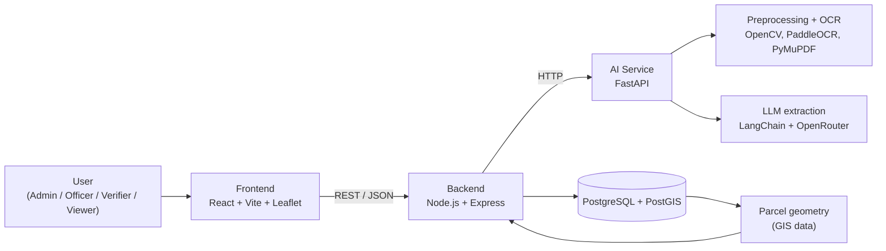
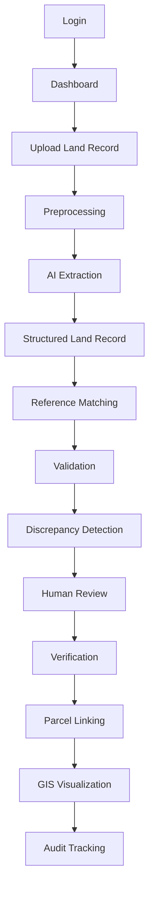
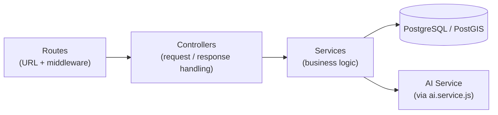
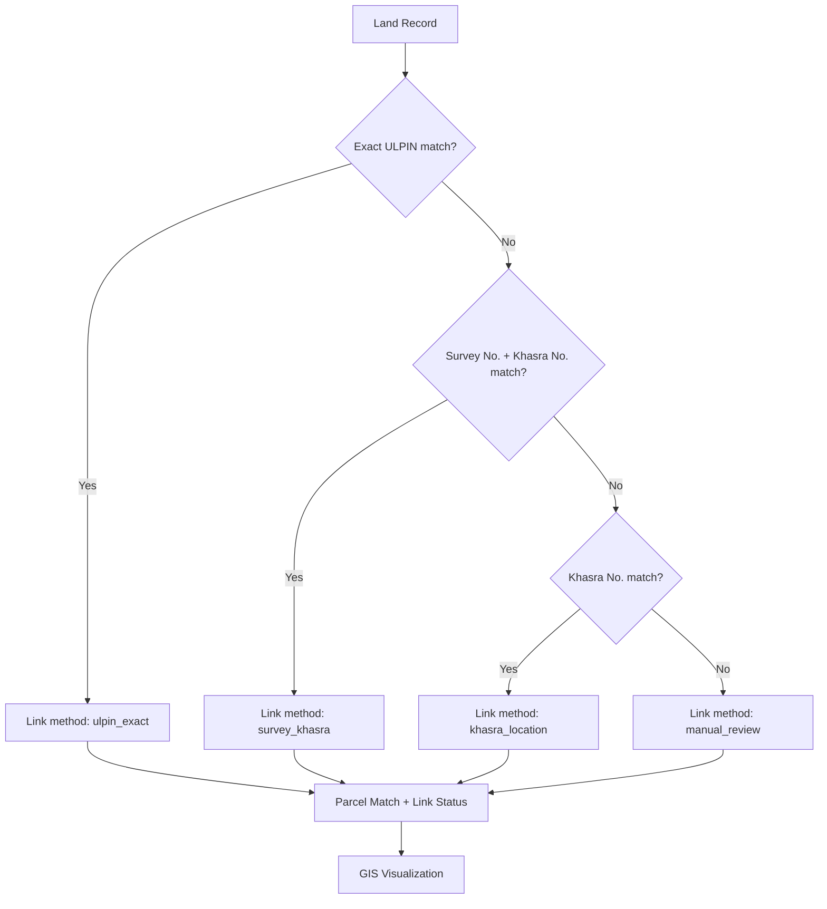
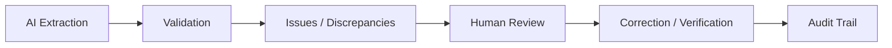
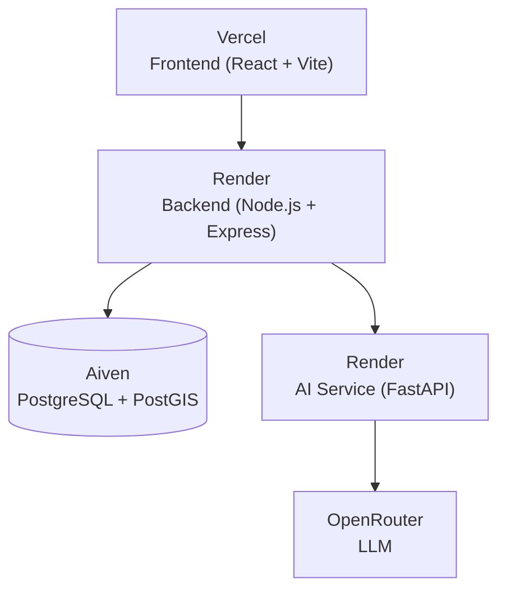

# IntelliLandAI

**AI-powered Intelligent Land Record Digitization, Validation and Parcel Linking Platform**

IntelliLandAI is an AI-assisted prototype that modernizes land-record workflows. It digitizes scanned and legacy land records (including poor-quality, handwritten and regional-language documents), extracts structured fields using OCR and an LLM, validates them against authorized reference/demo data, routes discrepancies to human reviewers, links records to GIS parcels, and visualizes them on a map, with a complete audit trail.

> **Core concept**
> **Document** tells *WHAT / WHICH LAND* · **GIS** tells *WHERE* · **Validation** checks *WHETHER INFORMATION IS CONSISTENT*

> ⚠️ **Prototype notice:** IntelliLandAI is an AI-assisted decision-support prototype built on synthetic/demo data. It does **not** replace authorized government verification, legal land-record authorities, or official government systems.


---

### 🎥 Demo Video

[▶️ Watch IntelliLandAI Demo Video on YouTube](YOUR_YOUTUBE_VIDEO_LINK)

### 🌐 Live Demo

[🚀 Open IntelliLandAI Live Demo](https://intelliland-qxosqwgas-bhumatrix.vercel.app/login)

---
## 🔐 Demo Login Credentials

For demonstration purposes, the following prototype account can be used:

| Role | Email | Password |
|---|---|---|
| Admin | `admin@intelliland.local` | `Admin@123` |

> **Note:** These credentials are provided only for the prototype/demo environment. Do not use demo credentials in a production deployment.
>
> 
## 📑 Table of Contents

- [Problem](#-problem)
- [Solution](#-solution)
- [Key Features](#-key-features)
- [System Architecture](#-system-architecture)
- [End-to-End Workflow](#-end-to-end-workflow)
- [Technology Stack](#-technology-stack)
- [Frontend](#-frontend)
- [Backend](#-backend)
- [AI Service](#-ai-service)
- [Database](#-database)
- [GIS & Parcel Linking](#-gis--parcel-linking)
- [Validation & Human Verification](#-validation--human-verification)
- [Deployment Architecture](#-deployment-architecture)
- [Repository Structure](#-repository-structure)
- [Local Setup](#-local-setup)
- [Environment Variables](#-environment-variables)
- [Running Locally](#-running-locally)
- [API Overview](#-api-overview)
- [Sample Data](#-sample-data)
- [Security](#-security)
- [Government / Domain Context](#-government--domain-context)
- [Limitations](#-limitations)
- [Future Scope](#-future-scope)
- [Contributing](#-contributing)
- [License](#-license)
- [Acknowledgements](#-acknowledgements)

---

## 🧩 Problem

Land-record modernization faces several practical challenges:

- Large volumes of **scanned and legacy records** exist only as images or PDFs.
- Documents are often **poor quality** (faded, skewed, noisy, stained), **handwritten**, or written in **local/regional languages**.
- Key details (owner, survey/khasra numbers, area, mutation and registration references) are locked inside unstructured documents.
- Textual records are frequently **disconnected from geographic parcels**, making it hard to see *where* a record actually lies.
- Inconsistencies between records and reference data are hard to detect manually at scale.
- Digitized outputs need **human accountability** and an **audit trail** before they can be trusted.

## 💡 Solution

IntelliLandAI provides an end-to-end prototype pipeline:

1. **Digitize** uploaded land-record documents with preprocessing and OCR.
2. **Extract** important land-record fields into structured JSON using an LLM-assisted parser.
3. **Validate** extracted data against authorized reference/demo data and flag discrepancies.
4. **Verify** through a human-in-the-loop review and correction workflow.
5. **Link** each land record to a GIS parcel using an identifier hierarchy.
6. **Visualize** linked parcels on an interactive map.
7. **Audit** every important action for traceability.

## ✨ Key Features

| Area | Current prototype capability |
|---|---|
| Document digitization | Upload of scanned/legacy records with preprocessing (e.g., deskewing) and OCR |
| Document diversity | Designed for printed and handwritten records, and local/regional-language documents |
| Structured extraction | AI service returns structured JSON with land-record fields |
| Validation | Comparison of extracted data with reference/demo data and discrepancy detection |
| Human verification | Review, correction and verification before a record is treated as verified |
| Parcel linking | Identifier-hierarchy matching (ULPIN → Survey + Khasra → Khasra → manual review) |
| GIS visualization | Leaflet-based map of linked parcels with parcel details |
| Access control | JWT authentication with role-based authorization |
| Audit tracking | Audit logging and an audit-history view |
| Dashboard | Overview of documents and processing state |

## 🏗️ System Architecture

### A. Logical application architecture

The application is modular: **Frontend → Backend → AI Service → Database / GIS**.



| Layer | Responsibility |
|---|---|
| **Frontend** | User interface: login, dashboard, upload, document details, validation review, verification, GIS map, audit history |
| **Backend** | Authentication/authorization, file upload, document and land-record APIs, validation and verification workflows, parcel linking, audit logging, database access, and orchestration of calls to the AI service |
| **AI Service** | Document preprocessing, OCR/text extraction, LLM-assisted structured field extraction and normalization; returns structured JSON to the backend |
| **Database / GIS** | Persistent storage of users, documents, land records, validation/verification results, audit logs, and PostGIS parcel geometry |

> The deployment architecture (where each layer is hosted) is described in [Deployment Architecture](#-deployment-architecture).

## 🔄 End-to-End Workflow



| Step | Description |
|---|---|
| Login | User authenticates and receives a JWT; UI access depends on role |
| Dashboard | Overview of documents and processing status |
| Upload | A scanned/legacy land record (image or PDF) is uploaded through the backend |
| Preprocessing | The AI service cleans the document (e.g., deskewing) to improve readability |
| AI Extraction | OCR and LLM-assisted parsing pull out land-record fields |
| Structured Record | Extracted fields are normalized into a structured land record |
| Reference Matching | The record is compared with authorized reference/demo data |
| Validation | Field-level consistency checks are performed |
| Discrepancy Detection | Mismatches and issues are flagged for attention |
| Human Review | A reviewer inspects extracted values and flagged issues |
| Verification | The reviewer corrects and/or verifies the record |
| Parcel Linking | The record is matched to a GIS parcel using the identifier hierarchy |
| GIS Visualization | The linked parcel is shown on the map |
| Audit Tracking | Actions are logged and viewable in audit history |

## 🧰 Technology Stack

| Layer | Technology | Purpose |
|---|---|---|
| Frontend | React, Vite, Tailwind CSS / CSS, Axios | Single-page application and API communication |
| Backend | Node.js, Express.js, REST APIs | Business logic, workflows, API layer |
| AI Service | Python, FastAPI, Uvicorn | Document-processing microservice |
| OCR | PaddleOCR | Text extraction from scanned documents |
| Document Processing | OpenCV, scikit-image, deskew, PyMuPDF | Image preprocessing, deskewing, PDF handling |
| LLM | LangChain, LangChain OpenAI integration, OpenRouter-compatible LLM | Structured field extraction and document understanding |
| Database | PostgreSQL, pgcrypto | Relational storage of application and land-record data |
| GIS | PostGIS, Leaflet / React-Leaflet | Parcel geometry storage and map visualization |
| Authentication | JWT, role-based middleware | Authentication and authorization |
| File Uploads | Multer | Multipart file upload handling in the backend |
| Hosting | Vercel (frontend), Render (backend, AI service), Aiven (PostgreSQL + PostGIS) | Deployed prototype |
| Version Control | Git, GitHub | Source control and collaboration |

## 🖥️ Frontend

**Directory:** `Frontend/` · **Stack:** React, Vite, Leaflet / React-Leaflet, CSS / Tailwind CSS, Axios.

The frontend is organized by responsibility:

- **`pages/`**: route-level screens (`Login`, `Dashboard`, `Documents`, `DocumentUpload`, `DocumentDetails`, `ValidationReview`, `GISMap`, `AuditHistory`).
- **`components/`**: reusable UI grouped by domain (`audit`, `common`, `dashboard`, `documents`, `gis`, `layout`, `validation`).
- **`services/`**: API modules that wrap backend calls (`api.js` for the shared Axios setup, plus `auth`, `dashboard`, `document`, `parcel`, `validation`, `verification`, and `audit` services).
- **`hooks/`**: data/state hooks (`useAuth`, `useDashboard`, `useDocuments`, `useValidation`).
- **`context/`**: global state via `AuthContext` and `AppContext`.
- **`routes/`** and **`layouts/`**: routing (`AppRoutes.jsx`) and the shared page shell (`MainLayout.jsx`).

```text
Frontend/src/
├── App.jsx
├── main.jsx
├── components/    (audit, common, dashboard, documents, gis, layout, validation)
├── context/       (AppContext.jsx, AuthContext.jsx)
├── hooks/         (useAuth, useDashboard, useDocuments, useValidation)
├── layouts/       (MainLayout.jsx)
├── pages/         (AuditHistory, Dashboard, DocumentDetails, DocumentUpload,
│                   Documents, GISMap, Login, ValidationReview)
├── routes/        (AppRoutes.jsx)
├── services/      (api, audit, auth, dashboard, document, parcel,
│                   validation, verification)
└── utils/
```

Data flow in the UI: **Page → Hook → Service → Backend API**, with `AuthContext` providing the authenticated session.

## ⚙️ Backend

**Directory:** `Backend/` · **Stack:** Node.js, Express.js, REST APIs, JWT, PostgreSQL client, Multer.

**Responsibilities:** authentication, authorization, document management, file upload, land-record APIs, validation workflow, verification workflow, parcel linking, audit logging, database communication, and communication with the AI service.

The backend follows a layered **Route → Controller → Service → Database** design:



- **Routes** map endpoints to controllers and attach middleware (auth, role checks, uploads).
- **Controllers** handle HTTP input/output for each domain.
- **Services** hold business logic (e.g., `processing.service.js`, `validation.service.js`, `verification.service.js`, `parcel.service.js`, `audit.service.js`, `ai.service.js`).
- **Middleware** provides JWT authentication, role-based authorization, upload handling and centralized error handling.
- **Config / Utils** cover environment and database configuration, JWT helpers, response helpers and validators.

```text
Backend/src/
├── app.js
├── server.js
├── config/        (db.js, env.js)
├── controllers/   (audit, auth, dashboard, document, landRecord,
│                   parcel, validation, verification)
├── middleware/    (auth, error, role, upload)
├── routes/        (audit, auth, dashboard, document, landRecord,
│                   parcel, validation, verification)
├── services/      (ai, audit, document, parcel, processing,
│                   validation, verification)
└── utils/         (jwt.js, response.js, validators.js)
```

## 🤖 AI Service

**Directory:** `ai-service/` · **Stack:** Python, FastAPI, OpenCV, PaddleOCR, PyMuPDF, scikit-image, deskew, LangChain, LangChain OpenAI integration, OpenRouter-compatible LLM.

```text
ai-service/
├── api/
│   ├── __init__.py
│   └── routes/
│       ├── __init__.py
│       └── document.py
├── services/
│   ├── __init__.py
│   └── document_processor.py
├── tools/
│   ├── compare.py
│   └── parser.py
└── api_server.py
```

The FastAPI application is defined in `ai-service/api_server.py` as `app = FastAPI(...)`.

| Endpoint | Method | Purpose |
|---|---|---|
| `/ai/process-document` | `POST` | Main endpoint: processes an uploaded land-record document and returns structured JSON |
| `/health` | `GET` | Health check |

Interactive API documentation is available at `/docs` (FastAPI's built-in Swagger UI).

### Processing pipeline

```text
Document Upload
  → File Validation
  → Preprocessing
  → OCR / Text Extraction
  → Document Understanding
  → Structured Field Extraction
  → Normalization
  → Validation Support
  → Structured JSON
  → Backend
```

| Stage | What it does |
|---|---|
| File Validation | Checks the incoming file before processing |
| Preprocessing | Image cleanup and deskewing using OpenCV, scikit-image and deskew; PDF handling with PyMuPDF |
| OCR / Text Extraction | PaddleOCR extracts text from the document |
| Document Understanding | LLM-assisted interpretation of the extracted text (via LangChain and an OpenRouter-compatible model) |
| Structured Field Extraction | Important land-record fields are extracted into a structured form |
| Normalization | Extracted values are normalized for downstream use |
| Validation Support | Comparison utilities support checking data against reference/demo data |
| Structured JSON | Result is returned to the backend for storage, validation and review |

> **Note:** The AI pipeline is part of a working prototype. Extraction quality depends on document quality, language and handwriting, and this README makes no claim of measured accuracy. All AI output is intended for human review.

## 🗄️ Database

**Technology:** PostgreSQL with the **PostGIS** and **pgcrypto** extensions. In the deployed prototype, the database is hosted on **Aiven**.

The database stores application and land-record information, including:

- Users
- Documents
- Land records
- Owners
- Mutations
- Registrations
- Legacy records
- Validation results
- Verification records
- Audit logs
- Parcels
- Parcel links

**Why PostGIS?** PostGIS enables storage of geographic parcel geometry, spatial data handling, GIS visualization, and linking of structured land records to parcel locations.

The current project uses **synthetic/demo data** only.

## 🗺️ GIS & Parcel Linking

```text
Land record (identifiers / details)
        +
Parcel database (geographic geometry)
        =
Linked land record + map visualization
```

The GIS component combines **PostGIS** (parcel geometry) on the backend with **Leaflet / React-Leaflet** on the frontend (map view and parcel details). The parcel data is prototype/synthetic.

### Identifier hierarchy

The system attempts parcel matching using identifiers in the following order:

1. **Exact ULPIN**
2. **Survey Number + Khasra Number**
3. **Khasra Number**
4. **Manual review** when no suitable match exists



Current parcel-link methods include `ulpin_exact`, `survey_khasra`, `khasra_location` and `manual_review`.

> Parcel linking runs against the project's own prototype parcel data. It is **not** connected to live government cadastral databases.

## ✅ Validation & Human Verification

AI extraction never automatically becomes a final authoritative record.



- **Validation** compares extracted fields with authorized reference/demo data and surfaces issues and discrepancies.
- **Human review** lets a person inspect the document, the extracted values and any flagged issues.
- **Correction / verification** records the reviewer's decision.
- **Audit trail** records actions for traceability.

IntelliLandAI is designed to **assist** officers and reviewers, not to replace them.

### Document types

The system works with document categories such as **ROR**, **Mutation**, **Registration**, **Handwritten** and **Map**. Synthetic/demo records are used for demonstration.

### Document quality

The project considers document quality levels: **clean**, **medium**, **poor** and **very poor**. This matters because real-world land records are frequently old, faded, skewed, stained, handwritten or photographed under imperfect conditions, and a digitization workflow must cope with the full range rather than only clean scans. Different quality levels also help demonstrate where human verification is most important.

### User roles

The application defines four roles: **ADMIN**, **OFFICER**, **VERIFIER** and **VIEWER**. At a high level, they separate administration, land-record processing, verification/review, and read-only access. Role checks are enforced in the backend through role-based middleware.

## 🚀 Deployment Architecture

| Component | Platform | URL |
|---|---|---|
| Frontend | Vercel | https://intelliland.vercel.app |
| Backend | Render | https://intelliland-backend.onrender.com |
| Backend health | Render | https://intelliland-backend.onrender.com/health |
| AI Service | Render | https://intellandai.onrender.com |
| AI Service docs | Render | https://intellandai.onrender.com/docs |
| AI health | Render | https://intellandai.onrender.com/health |
| Database | Aiven | PostgreSQL + PostGIS (private) |



The AI service starts in production with:

```bash
uvicorn api_server:app --host 0.0.0.0 --port $PORT
```

> Free-tier hosting can cause a slow first response while a service wakes up.

## 📁 Repository Structure

```text
intelliLandAI/
├── ai-service/        # FastAPI AI microservice (OCR, preprocessing, extraction)
├── Backend/           # Node.js + Express REST API
├── Frontend/          # React + Vite web application
├── database/          # Database schema / SQL assets (PostgreSQL + PostGIS)
├── gis/               # GIS / parcel data assets
├── sample-data/       # Synthetic/demo land-record data
├── test_outputs/      # Outputs from testing/experiments
├── .gitignore
├── README.md
├── data.json
├── deskewed_document.jpg
├── main.py
├── pyproject.toml
├── trial.ipynb
└── uv.lock
```

| Path | Purpose |
|---|---|
| `Frontend/` | User interface: dashboard, upload, validation review, GIS map, audit history |
| `Backend/` | REST API, authentication, workflows, database access, AI service integration |
| `ai-service/` | Document processing pipeline exposed through FastAPI |
| `database/` | Database setup assets for PostgreSQL + PostGIS |
| `gis/` | GIS and parcel-related assets |
| `sample-data/` | Synthetic/demo data used to demonstrate the platform |
| `test_outputs/` | Experiment and test outputs |
| `pyproject.toml`, `uv.lock` | Python project metadata and locked dependencies |

The remaining top-level files (`data.json`, `deskewed_document.jpg`, `main.py`, `trial.ipynb`) are development/demo artifacts from prototyping.

## 🛠️ Local Setup

### Prerequisites

- [Git](https://git-scm.com/)
- [Node.js](https://nodejs.org/) and npm
- [Python](https://www.python.org/) (3.x; see `pyproject.toml` for the required version)
- [PostgreSQL](https://www.postgresql.org/) with the [PostGIS](https://postgis.net/) extension
- An OpenRouter API key (or another OpenRouter-compatible LLM endpoint) for AI extraction

### Clone

```bash
git clone https://github.com/<your-username>/intelliLandAI.git
cd intelliLandAI
```

### A. Frontend

```bash
cd Frontend
npm install
```

The frontend's API base URL is configured in `Frontend/src/services/api.js`. Point it at your local backend (or the deployed backend) as needed.

### B. Backend

```bash
cd Backend
npm install
```

Create a `.env` file in `Backend/` using the [environment variables](#-environment-variables) below. Backend configuration is read in `Backend/src/config/env.js`.

### C. AI Service

Create and activate a virtual environment, then install the Python dependencies declared in `pyproject.toml` (for example with `uv`, or with `pip` in a virtual environment):

```bash
# Option 1: uv (the repository includes uv.lock)
uv sync

# Option 2: pip inside a virtual environment
python -m venv .venv
source .venv/bin/activate      # Windows: .venv\Scripts\activate
pip install .                  # installs dependencies declared in pyproject.toml
```

Create a `.env` for the AI service with your OpenRouter settings (see below). PaddleOCR may download model files on first run.

### D. Database

1. Create a PostgreSQL database (for example `intelliland`).
2. Enable the required extensions:

```sql
CREATE EXTENSION IF NOT EXISTS postgis;
CREATE EXTENSION IF NOT EXISTS pgcrypto;
```

3. Apply the schema and demo data from the `database/`, `gis/` and `sample-data/` directories using `psql` or your preferred SQL client. Refer to the files in those directories for the exact scripts.

## 🔐 Environment Variables

Use placeholder values only, and **never commit real secrets**. Actual credentials must be configured locally (for example in untracked `.env` files).

```env
# Database
DATABASE_URL=your_database_url
DB_HOST=localhost
DB_PORT=5432
DB_NAME=intelliland
DB_USER=postgres
DB_PASSWORD=your_password

# Backend → AI service
AI_SERVICE_URL=http://localhost:8000

# LLM (AI service)
OPENROUTER_API_KEY=your_openrouter_api_key
OPENROUTER_MODEL=your_model
```

> The backend also requires a JWT secret and any other settings defined in `Backend/src/config/env.js`. Check that file for the exact variable names used by your version of the code.

## ▶️ Running Locally

Start each component in its own terminal.

**Database**: make sure PostgreSQL (with PostGIS) is running and the schema/demo data are loaded.

**AI Service**

```bash
cd ai-service
uvicorn api_server:app --host 0.0.0.0 --port 8000
```

The API docs will be available at `http://localhost:8000/docs`, and the health check at `http://localhost:8000/health`.

> In production, Render runs: `uvicorn api_server:app --host 0.0.0.0 --port $PORT`

**Backend**

```bash
cd Backend
npm run dev
```

Check the `scripts` section of `Backend/package.json` for the available start commands (for example `npm start`).

**Frontend**

```bash
cd Frontend
npm run dev
```

Vite prints the local URL (typically `http://localhost:5173`).

## 🔌 API Overview

A high-level overview by area. Exact paths and request/response schemas are defined in the route files under `Backend/src/routes/` and in the AI service's `/docs`.

| Area | Purpose |
|---|---|
| **Authentication** | Login and session/token handling |
| **Dashboard** | Summary data for the dashboard view |
| **Documents** | Document upload, listing, details and processing status |
| **Land Records** | Access to structured land-record data |
| **Validation** | Validation results and discrepancy review |
| **Verification** | Human verification and correction workflow |
| **Parcels** | Parcel data and parcel-link operations for GIS visualization |
| **Audit** | Audit log and history |

**AI Service**

| Method | Endpoint | Description |
|---|---|---|
| `POST` | `/ai/process-document` | Process a document and return structured JSON |
| `GET` | `/health` | Service health check |

**Backend**

| Method | Endpoint | Description |
|---|---|---|
| `GET` | `/health` | Service health check |

## 🧪 Sample Data

The prototype uses **synthetic/demo land records and parcel data**. It does **not** come from government databases.

The demo dataset is intended to demonstrate:

- Different document types (ROR, Mutation, Registration, Handwritten, Map)
- Different document quality levels (clean, medium, poor, very poor)
- Land-record extraction
- Validation against reference/demo data
- Parcel linking
- GIS visualization

## 🔒 Security

Security-related concepts in the current prototype:

- **JWT authentication** for API access
- **Role-based authorization** (ADMIN, OFFICER, VERIFIER, VIEWER) via backend middleware
- **Environment variables** for secrets (API keys, database credentials, JWT secret), not committed to the repository
- **Backend API separation**: the frontend never talks to the database directly; database access goes through the backend
- **Input validation** through backend validators
- **File upload handling** via Multer with upload middleware
- **Centralized error handling** middleware

> This is a prototype. A production deployment would require additional hardening, such as a formal security review, stricter upload controls and scanning, secrets management, rate limiting, monitoring, backups and compliance review.

## 🏛️ Government / Domain Context

The project is inspired by real land-record digitization and modernization challenges involving concepts such as:

- Land records
- ROR / Khatauni
- Khasra and survey numbers
- Mutation
- Registration
- ULPIN
- GIS parcel mapping
- The DILRMP (Digital India Land Records Modernization Programme) context

**Important clarification:** IntelliLandAI does **not** claim direct integration with DILRMP, ULPIN systems, Bhu Naksha, LRMS, or any other government database. It uses its own synthetic/demo data. Government systems are considered as **future/possible integration context** and would require authorized APIs and access.

## ⚠️ Limitations

IntelliLandAI is intentionally scoped as a prototype. Being transparent about its boundaries:

- It is a **prototype/demo system** demonstrating an end-to-end workflow.
- It uses **synthetic/demo data** for records and parcels.
- It makes **no claim of official government integration**.
- It makes **no claim of legal authority**; outputs are not official records.
- **AI extraction requires human verification.**
- No accuracy figures are claimed; extraction quality varies with document quality, language and handwriting.
- **Production-grade deployment** would require additional security, scalability and validation work.
- **Government data integration** would require authorized APIs and access.

## 🔭 Future Scope

The following are **planned/possible improvements, not current features**:

- Government-authorized data integration
- Support for more regional languages
- Improved handwriting recognition
- Advanced document layout understanding
- Better confidence scoring
- More sophisticated validation rules
- Scalable object storage for documents
- Advanced GIS capabilities
- Production-grade authentication and security
- Larger validated datasets
- Improved monitoring and observability

## 🤝 Contributing

Contributions, issues and suggestions are welcome.

1. Fork the repository
2. Create a feature branch: `git checkout -b feature/your-feature`
3. Commit your changes: `git commit -m "Add your feature"`
4. Push the branch: `git push origin feature/your-feature`
5. Open a Pull Request

Please never commit secrets or real land-record data.

## 📄 License

A license has not yet been specified for this repository. Add a `LICENSE` file (for example MIT or Apache-2.0) and update this section accordingly.

## 🙏 Acknowledgements

- The open-source communities behind React, Vite, Leaflet, Express, FastAPI, PostgreSQL, PostGIS, OpenCV, PaddleOCR, PyMuPDF, scikit-image and LangChain
- OpenRouter for LLM access
- Vercel, Render and Aiven for hosting the prototype
- The land-record modernization initiatives and domain context that inspired this project
